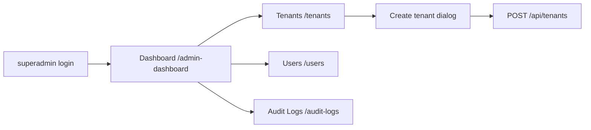
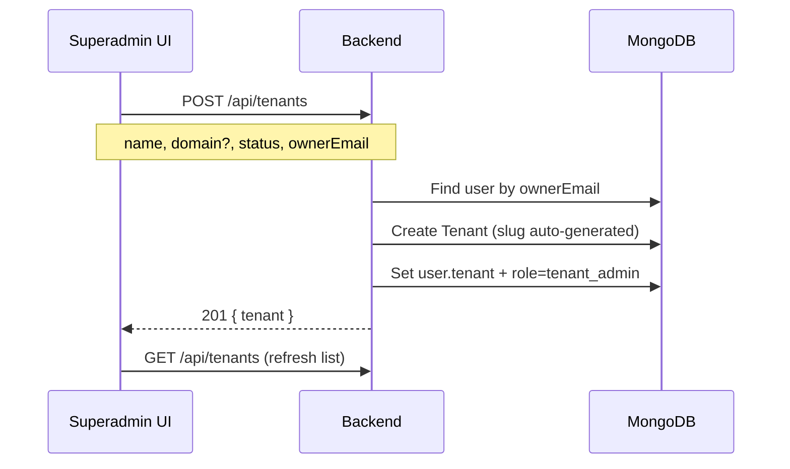

# Backend API — Multi-tenant Event Platform

Monorepo with an Express + MongoDB API (`server/`) and a React + Vite SPA (`frontend/`). Supports **superadmin** platform management and **tenant-scoped** users (tenant admin, member, viewer).

## Quick start

```bash
# Terminal 1 — API
cd server
npm install
# create .env (see server/README.md)
npm run dev

# Terminal 2 — seed data (optional)
cd server
npm run seed          # superadmin only
npm run seed:demo     # 3 tenants + demo users

# Terminal 3 — SPA
cd frontend
npm install
cp .env.example .env   # VITE_API_URL=http://127.0.0.1:5000
npm run dev
```

Open **http://localhost:5173**

| Role | Email | Password |
|------|-------|----------|
| Superadmin | `superadmin@platform.com` | `SuperAdmin@123` |
| Tenant owner (demo) | `owner@acme.com` | `Demo@123` |
| Member (demo) | `member@acme.com` | `Demo@123` |

More docs: [server/README.md](./server/README.md) · [frontend/README.md](./frontend/README.md)

---

## Application flow

### 1. Login → role → home page

```mermaid
flowchart TD
  A[User opens /login] --> B[POST /api/auth/login]
  B --> C[JWT access token with role + tenantId]
  C --> D{role in JWT?}
  D -->|superadmin| E[/admin-dashboard]
  D -->|tenant_admin / member / viewer| F[/tenant-dashboard]
```

- Role is read from the **JWT** (`role` claim).
- `ProtectedRoute` requires a valid access token.
- `RoleDashboardRoute` prevents cross-access (superadmin cannot open tenant routes and vice versa).

### 2. Superadmin navigation



| Page | URL | API |
|------|-----|-----|
| Dashboard | `/admin-dashboard` | Overview + links to Tenants & Users |
| **All tenants** | `/tenants` | `GET /api/tenants` |
| **All users** | `/users` | `GET /api/users` |
| Audit logs | `/audit-logs` | `GET /api/auth/audit-logs` |

### 3. Create tenant flow (superadmin)



**Request body (`POST /api/tenants`):**

| Field | Required | Notes |
|--------|----------|--------|
| `name` | Yes | Display name; slug generated on server |
| `ownerEmail` | Yes (superadmin) | Existing user becomes `tenant_admin` |
| `domain` | No | Optional; must be unique if set |
| `status` | No | `active` \| `inactive` \| `suspended` (default `active`) |

Superadmin **must** pass `ownerEmail` — the superadmin account is never assigned as tenant owner.

### 4. Tenant user flow

```mermaid
flowchart TD
  R[Register /sign-up] --> L[Login]
  L --> TD[/tenant-dashboard]
  TD --> E[Events - planned]
  TD --> AL[Audit Logs]
```

Users linked to a tenant see the **tenant dashboard** and tenant sidebar (no Tenants / Users pages).

### 5. Roles & permissions (summary)

| Role | Tenant list | User list | Create tenant | Tenant dashboard |
|------|-------------|-----------|---------------|------------------|
| `superadmin` | Yes | Yes | Yes | No (redirected) |
| `tenant_admin` | No | No | No* | Yes |
| `member` / `viewer` | No | No | No | Yes |

\*Non-superadmin tenant creation would assign the caller as owner (not used in UI today).

---

## Demo seed data

```bash
cd server
npm run seed:demo
```

Creates:

| Tenant | Owner | Domain |
|--------|-------|--------|
| Acme Events | `owner@acme.com` | acme.events.local |
| Globex Corporation | `owner@globex.com` | globex.local |
| Initech Solutions | `owner@initech.com` | initech.local |

Additional users: `member@acme.com`, `viewer@globex.com` (password `Demo@123`).

Script: `server/src/scripts/seed-demo-data.ts` — safe to re-run (skips existing records).

---

## API routes (tenants & users)

### Tenants (`/api/tenants`) — Bearer required

| Method | Path | Permission | Description |
|--------|------|------------|-------------|
| POST | `/` | `tenants:create` | Create tenant |
| GET | `/` | `tenants:read_any` | List all tenants (superadmin) |
| GET | `/:id` | `tenants:read_any` | Get tenant by id |
| PUT | `/:id/status` | `tenants:suspend` | Change status |
| DELETE | `/:id` | `tenants:delete` | Delete tenant |

### Users (`/api/users`) — Bearer required

| Method | Path | Permission | Description |
|--------|------|------------|-------------|
| GET | `/` | `users:read_any` | List all users (superadmin) |

---

## Frontend file map

| Area | Path |
|------|------|
| Routes | `frontend/src/routes/AppRoutes.tsx`, `paths.ts`, `RoleDashboardRoute.tsx` |
| Login / JWT role | `frontend/src/features/login/`, `features/auth/utils/jwt.ts` |
| Admin dashboard | `frontend/src/features/dashboard/AdminDashboardPage.tsx` |
| Tenant list + create | `frontend/src/features/tenants/TenantsPage.tsx` |
| User list | `frontend/src/features/users/UsersPage.tsx` |
| API clients | `frontend/src/services/api/tenantsApi.ts`, `usersApi.ts` |
| Redux | `frontend/src/store/slices/tenantSlice.ts`, `usersSlice.ts` |

---

## Manual test checklist

1. Login as **superadmin** → **Tenants** → see seeded tenants (Acme, Globex, Initech).
2. **Users** → see all emails including owners and superadmin.
3. **Create tenant** → use an email that already exists (e.g. register via Sign up first).
4. Logout → login as `owner@acme.com` / `Demo@123` → land on **Tenant dashboard** only.
